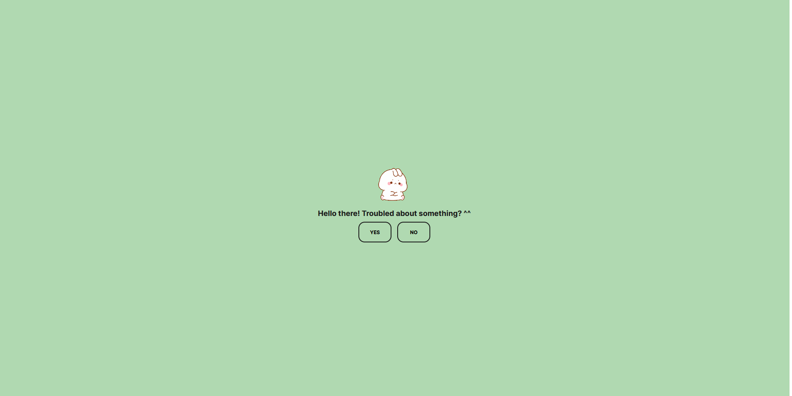

# Worry Blocker

---

This web application is designed to help ease anxiety by guiding users through a two-question process that requires simple yes or no answers. It aims to provide quick relief by encouraging self-reflection and offering a moment of pause for the user.

## How It Works

1. **Accessing the Application:**
   Users can access the application through a web browser by navigating to the [website](https://worry-blocker.vercel.app/).

2. **Answering the Questions:**
   Users will be prompted with two straightforward questions, each requiring a yes or no response. Questions are designed to promote self-awareness and reflection.
3. **Outcome:**
   Based on the user's responses, the application provides a calming message, affirmation, or suggestion aimed at reducing anxiety and promoting a sense of ease.

## Development

- **Technologies Used:**
  HTML, CSS, JavaScript

## Notes

This application is not a substitute for professional mental health assistance. If you are experiencing severe anxiety or mental health issues, please seek professional help.

---

### Credits to the icons/images used can be found on the [creds](./creds.txt) file.

---

## Author

🚀 [kerbethecoder](https://github.com/kerbethecoder)  
📫 krby.cnts@gmail.com  
📌 November 20, 2023

Happy coding! :philippines:
